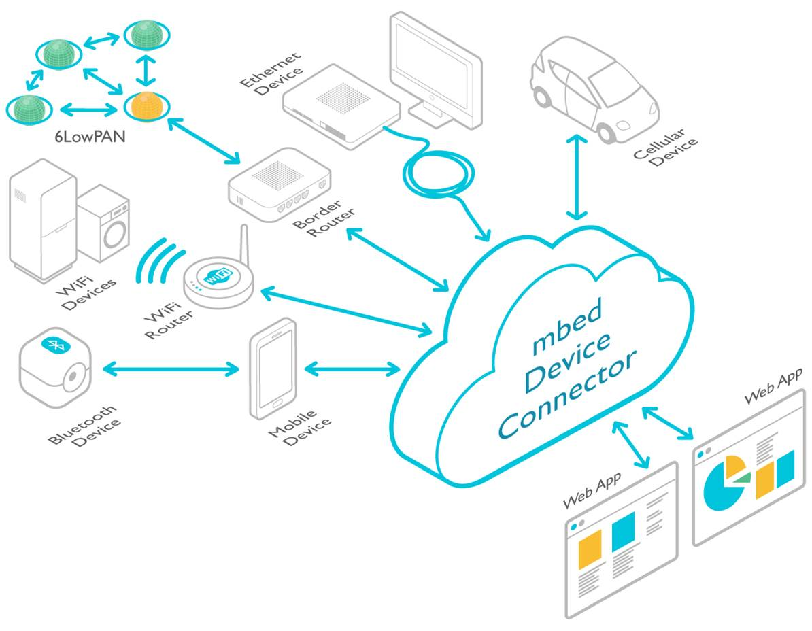

Introduction
=============

The ARM mbed Device Connector is a web service that lets you securely and energy efficiently connect Internet of Things (IoT) devices to the cloud, enabling data communication and device management. Devices are then available through REST APIs to enterprise software, web applications and cloud stacks. 

In a nutshell, mbed Device Connector simply connects devices and web applications.

To help device manufacturers join the Internet of Things, ARM mbed created mbed Client: a library that connects devices to mbed Device Connector Service, mbed Device Server (mDS) and to mbed-enabled cloud services from our partners.

All in all, mbed Device Connector is the glue between devices with mbed Client library and the web applications as illustrated below.

## Features

- Based on open industry standard protocols including CoAP/HTTP, TLS/TCP, DTLS/UDP and OMA LWM2M, enabling energy efficient data communication 
and device management.
- Includes strong end-to-end trust and security using open security standards.
- Works with REST APIs, making it easy to integrate with any system.
- Offers full integration of the developer console and web tools with mbed.com; there is no need to move to a different development environment 
after deployment.

## Key benefits

- Fully compatible with [mbed OS.](https://www.mbed.com/en/development/software/mbed-os/).
- Allows connecting mbed supported devices to the cloud simply and securely.
- Built to offer bandwidth efficient connectivity for even the most constrained IoT devices.
- Provides access to the ARM mbed IoT device ecosystem.
- Provided at no cost to IoT developers.
- Includes the latest mbed Device Server features.
- Licensable mbed Device Server allows flexible on-premises deployment.
